# Lab05-AREP - Sistema CRUD para manejo de propiedades

#### Objetivo del laboratorio

El objetivo de este laboratorio fue desarrollar un sistema CRUD para la gestión de propiedades inmobiliarias, aplicando conceptos de desarrollo web full stack y despliegue en la nube.

#### Descripción

El sistema debía permitir a los usuarios:

    Crear nuevos registros de propiedades.

    Consultar la lista completa de propiedades o los detalles de una en específico.

    Actualizar la información de una propiedad existente.

    Eliminar propiedades registradas.

Para lograrlo se implementó:

    Frontend (HTML + JavaScript): interfaz sencilla con formularios y listados para interactuar con el sistema.

    Backend (Spring Boot REST API): servicios REST que exponen las operaciones CRUD sobre las propiedades.

    Base de datos (MySQL): almacenamiento persistente de los registros usando JPA/Hibernate.

    Despliegue en AWS: el backend y la base de datos se desplegaron en instancias EC2 separadas.

#### Estructura del backend

El proyecto sigue una arquitectura típica de Spring Boot con separación entre backend y frontend:

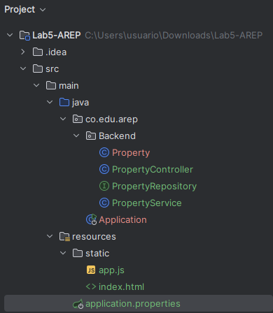

    src/main/java/co.edu.arep/Backend

        Application: Clase principal que arranca la aplicación.

        Property: Entidad que representa una propiedad.

        PropertyRepository: Interfaz JPA para la persistencia en base de datos.

        PropertyService: Lógica de negocio para manejar propiedades.

        PropertyController: Expone los servicios REST para las operaciones CRUD.

    src/main/resources/static

        index.html y app.js: Frontend sencillo en HTML y JavaScript para interactuar con el sistema.

    application.properties

        Configuración de la aplicación (conexión a la base de datos, puerto, etc.).

#### Creacion Base de datos (MySQL)

La base de datos se configuró en AWS siguiendo estos pasos:

    Creación de la base de datos

        Se creó la base de datos property_db y el usuario con permisos necesarios.

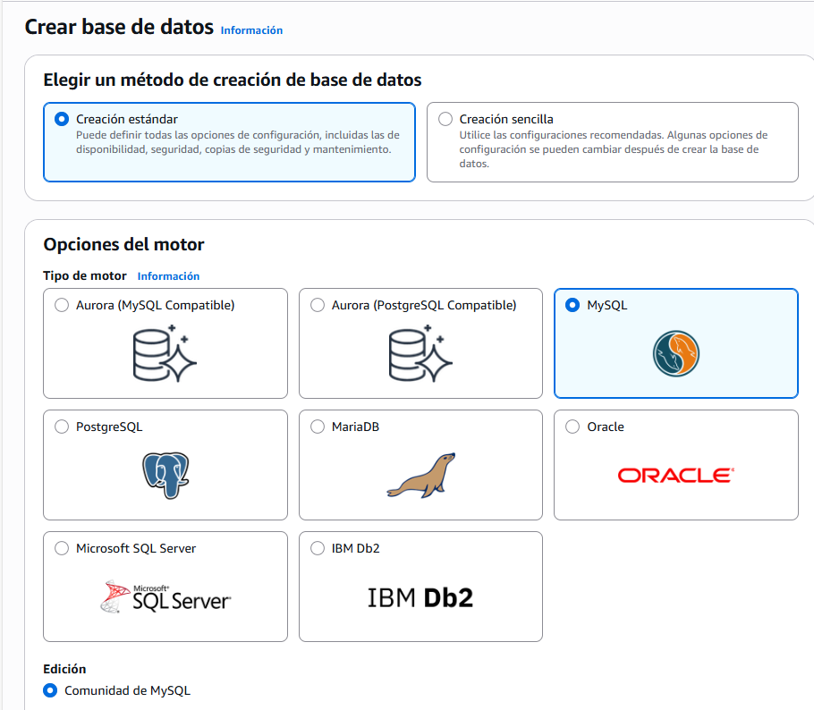

    Configuración inicial

        Se ajustaron parámetros de conexión y opciones de seguridad según las necesidades de la aplicación.

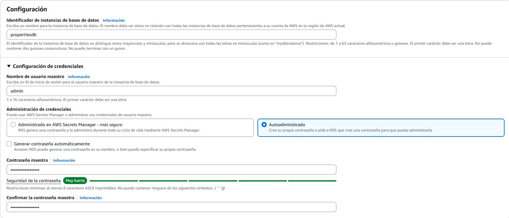

    Verficación Creación Base de datos

       Se confirma que la base de datos se haya creado correctamente. 

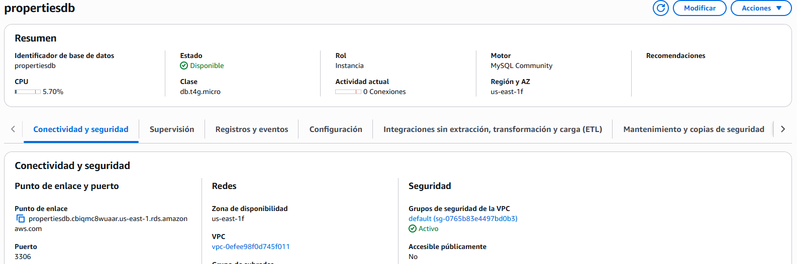

    Regla de entrada

        Se agregó una regla de seguridad en el grupo de AWS, permitiendo conexiones al puerto 3306  desde la IP del backend.

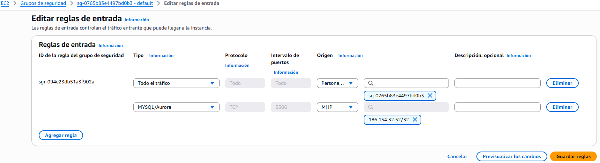

### AWS

Como estipulaba el laboratorio, el Backend-Frontend y la base de datos debian estar separados sobre dos instancias EC2 diferentes 

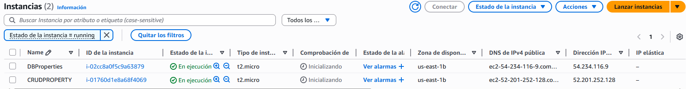

### Pruebas CRUD

#### A. Conexión a la base de datos

    Primero, nos conectamos a la base de datos desde DBeaver usando la referencia de la base de datos creada previamente en AWS.

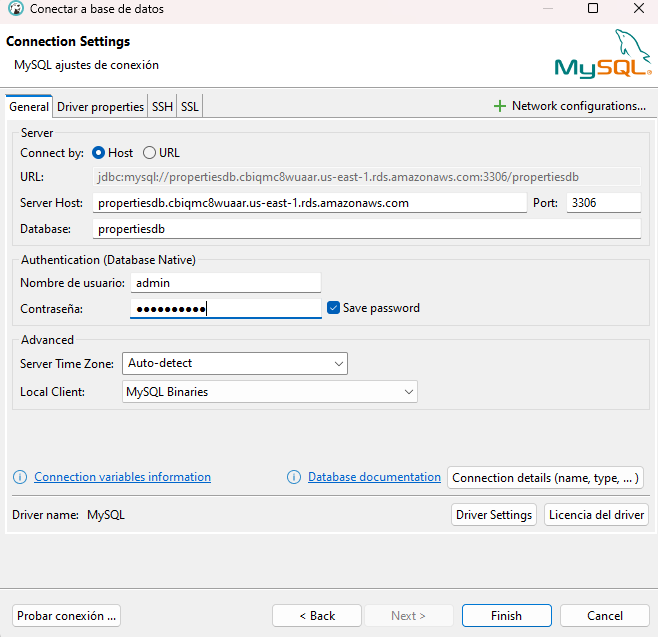

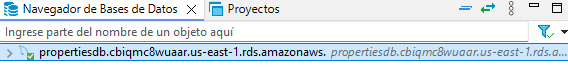

#### B. Crear (C)

    Se creó una nueva propiedad desde el despliegue del EC2 del backend.

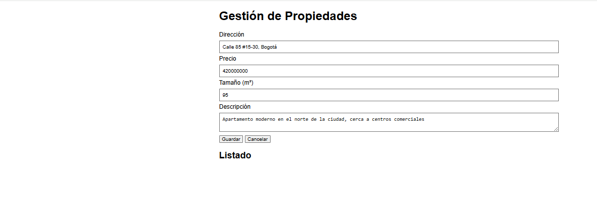

    Vemos que queda como propiedad listada. 

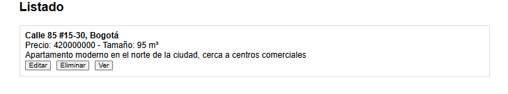

#### C. Leer (R)

    Usamos el endpoint que definimos en el controlador de /api/properties para verificar la creación. 

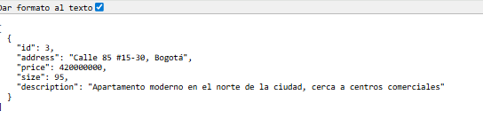

    Verificamos en DBeaver que el registro se hubiera agregado correctamente. 

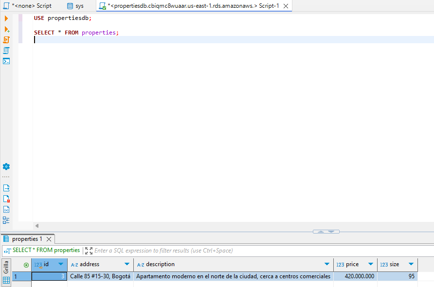

#### D. Actualizar (U)

    Utilizamos la propiedad creada anteriormente para actualizar un atributo de la propiedad. En este caso, hacemos el cambio del tamaño. 

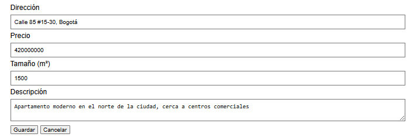

    Usamos el endpoint que definimos en el controlador de /api/properties para verificar la actualización. 

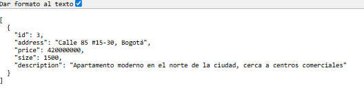

    Verificamos en DBeaver que el registro se hubiera actualizado correctamente. 

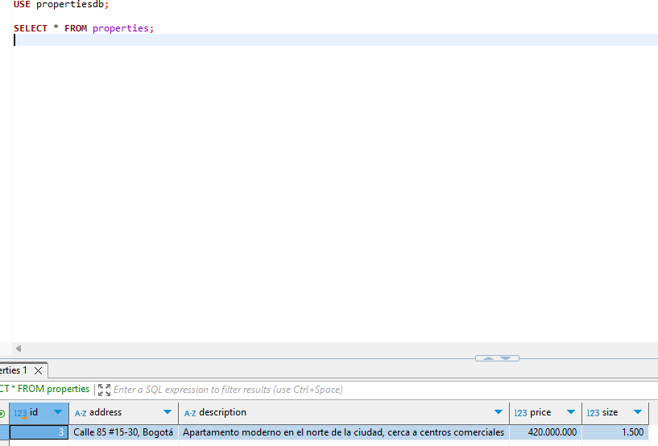

#### E. Eliminar (D)

    Con la misma propiedad que creamos anteriormente, procederemos a eliminar el registro, y haremos las mismas verificaciones.

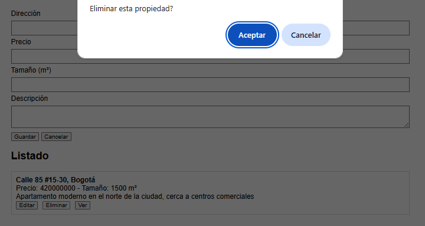

    Endpoint actualizado con la eliminacion. 

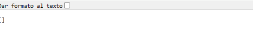

    Dbeaver

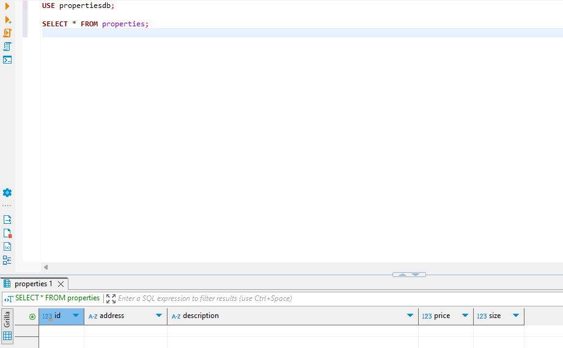

### Video de Instancias separadas en AWS y pruebas 

[Video de despliegue](./src/main/video/PruebasCRUD.mp4)

1. Presionar el enlace

2. Seleccionar "View RAW" 

3. El video se descargara y ya podra ser visible

## Tecnologías

Java 17 + 

MySQL 

Docker 

AWS

### Autor

Taller desarrollado por Santiago Silva Roa 